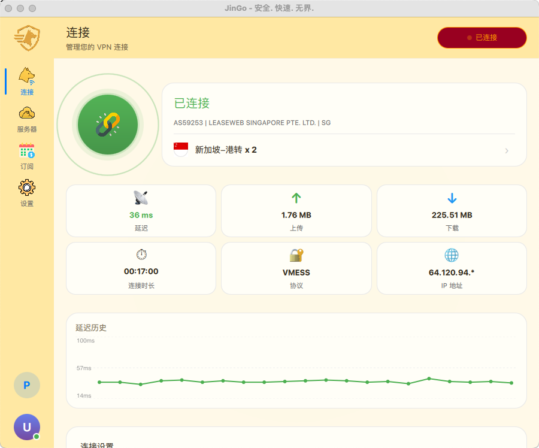
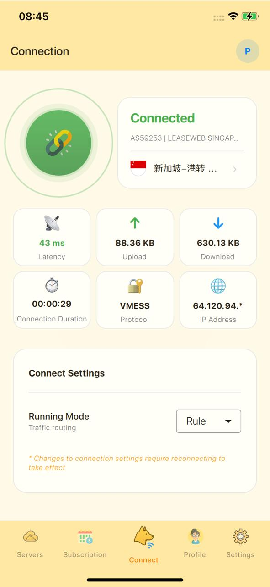
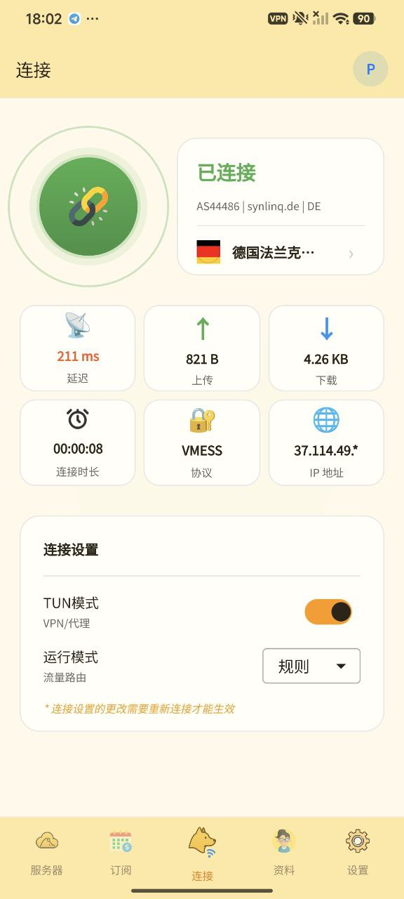
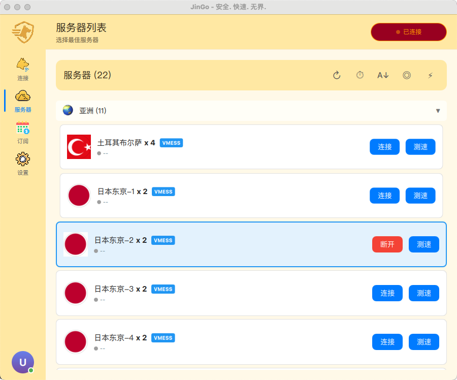
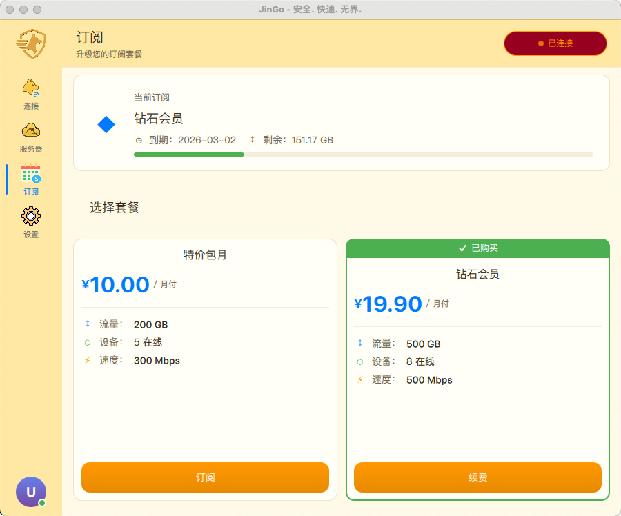
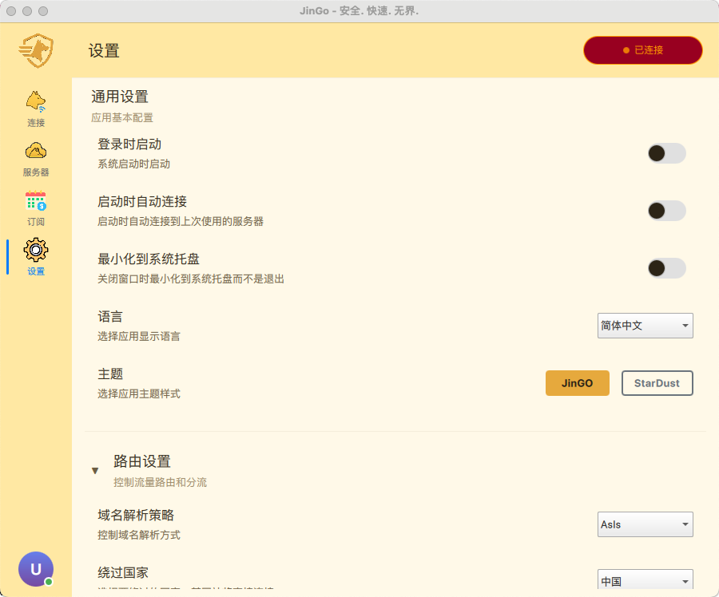
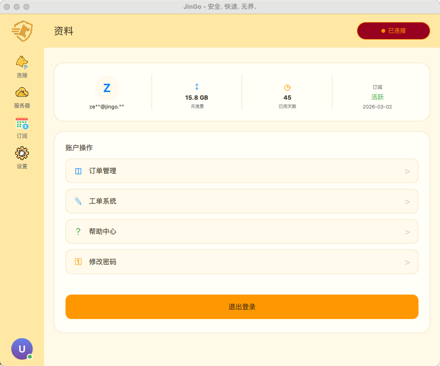

# JinGo VPN

[English](README.md)

跨平台 VPN 客户端，基于 Qt 6 和 Xray 核心构建。

## 声明

GitHub 仓库提供的是**基础功能版本**，开源版不定期更新，商业版本更新周期为**每周修复**。我们**不提供**免费的技术支持服务。本项目主要是给有能力的开发者提供参考和使用，是一种**技术交流**，任何任何形式的修改用于商业用途。

**开源不等于免费。** 官方提供定制服务，需要提供详细的需求，然后我们提供报价。费用不会很低，**500 USD 起步**，请权衡自身预算。

- Telegram 频道: [@OpineWorkPublish](https://t.me/OpineWorkPublish)
- Telegram 群组: [@OpineWorkOfficial](https://t.me/OpineWorkOfficial)

## 特性

- **跨平台支持**: Android、iOS、macOS、Windows、Linux
- **现代化界面**: Qt 6 QML 构建的流畅用户界面
- **多协议支持**: 基于 Xray 核心，支持 VMess、VLESS、Trojan、Shadowsocks 等
- **多语言**: 支持 8 种语言（中文、英文、越南语、高棉语、缅甸语、俄语、波斯语等）
- **白标定制**: 支持品牌定制和多租户部署

## 协议支持

| 协议 | 开源版 | 商业版 |
|:---|:---:|:---:|
| VMess | ✅ | ✅ |
| VLESS | ✅ | ✅ |
| VLESS+Reality | ⚠️ | ✅ |
| Trojan | ✅ | ✅ |
| Shadowsocks | ✅ | ✅ |
| WireGuard | ❌ | ✅ |
| SOCKS | ❌ | ✅ |
| HTTP | ❌ | ✅ |
| Hysteria | ❌ | ✅ |
| Hysteria2 | ❌ | ✅ |
| TUIC | ❌ 核心不支持 | ❌ 核心不支持 |
| IPv6 | ❌ | ✅ |

## 截图

<p align="center">
  
</p>

<p align="center">
  
  
</p>

<p align="center">
  
  
</p>

<p align="center">
  
  
</p>

## 目录

- [声明](#声明)
- [特性](#特性)
- [协议支持](#协议支持)
- [截图](#截图)
- [快速开始](#快速开始)
- [平台支持](#平台支持)
- [各平台分发模式](#各平台分发模式)
- [文档](#文档)
- [多语言支持](#多语言支持)
- [技术栈](#技术栈)
- [构建选项](#构建选项)
- [开发](#开发)
- [订阅格式](#订阅格式)
- [授权验证](#授权验证)
- [合规使用](#合规使用)
- [许可证](#许可证)

## 快速开始

### 前置条件

- **Qt**: 6.10.0+（推荐 6.10.0 或更高版本）
- **CMake**: 3.21+
- **编译器**:
  - macOS/iOS: Xcode 15+
  - Android: NDK 27.2+
  - Windows: MinGW 13+（Qt 自带）
  - Linux: GCC 11+ 或 Clang 14+

### 编译步骤

#### 1. Fork 仓库并配置白标

```bash
# 1. Fork 本仓库到自己的 GitHub 账号

# 2. Clone 你的 fork
git clone https://github.com/YOUR_USERNAME/JinGo.git
cd JinGo

# 3. 创建你的白标配置
cp -r white-labeling/1 white-labeling/YOUR_BRAND

# 4. 修改白标配置文件
# 编辑 white-labeling/YOUR_BRAND/bundle_config.json
{
    "panel_url": "https://your-api-server.com",
    "app_name": "YourApp",
    "support_email": "support@your-domain.com",
    ...
}

# 5. 替换应用图标
# 将你的图标放入 white-labeling/YOUR_BRAND/icons/
```

#### 2. 编译应用

所有构建脚本都在 `scripts/build/` 目录下：

```bash
# Android APK
./scripts/build/build-android.sh --release --abi arm64-v8a

# macOS App (Universal Binary: arm64 + x86_64)
./scripts/build/build-macos.sh --release

# iOS App (需要 Apple 开发者团队 ID)
./scripts/build/build-ios.sh --release --team-id YOUR_TEAM_ID

# Linux
./scripts/build/build-linux.sh --release

# Windows (PowerShell)
./scripts/build/build-windows.sh
```

#### 3. 指定白标品牌编译

```bash
./scripts/build/build-macos.sh --release --brand YOUR_BRAND
./scripts/build/build-android.sh --release --brand YOUR_BRAND
./scripts/build/build-ios.sh --release --brand YOUR_BRAND --team-id YOUR_TEAM_ID
```

### 输出位置

| 平台 | 输出文件 | 位置 |
|------|---------|------|
| Android | APK | `release/jingo-*-android.apk` |
| macOS | DMG | `release/jingo-*-macos.dmg` |
| iOS | IPA | `release/jingo-*-ios.ipa` |
| Windows | EXE/MSI | `release/jingo-*-windows.exe` |
| Linux | tar.gz | `release/jingo-*-linux.tar.gz` |

## 平台支持

| 平台 | 架构 | 最低版本 | 状态 |
|------|------|---------|------|
| Android | arm64-v8a, armeabi-v7a, x86_64 | API 28 (Android 9) | ✅ |
| iOS | arm64 | iOS 15.0 | ✅ |
| macOS | arm64, x86_64 | macOS 12.0 | ✅ |
| Windows | x64 | Windows 10 | ✅ |
| Linux | x64 | Ubuntu 20.04+ | ✅ |

## 各平台分发模式

### 分发格式

| 平台 | 格式 | 签名方式 | 安装方式 |
|------|------|---------|---------|
| Android | `.apk` | Keystore (apksigner) | 直接安装 / Google Play |
| iOS | `.ipa` | Apple 开发者证书 | TestFlight / App Store / 侧载 |
| macOS | `.dmg` | Developer ID（可选） | 拖入 Applications |
| Windows | `.exe` | 无代码签名（UAC 清单） | NSIS 安装包 |
| Linux | `.tar.gz` / `.deb` / `.rpm` | 无 | CPack |

### VPN 模式支持

| 功能 | Android | iOS | macOS | Windows | Linux |
|------|---------|-----|-------|---------|-------|
| TUN 模式 | VpnService | Network Extension | Root (直接 TUN) | WinTUN | TUN 设备 |
| 本地代理 (SOCKS/HTTP) | 支持 | 不支持（沙盒限制） | 支持 | 支持 | 支持 |
| 全局 VPN | 支持 | 支持 | 支持 | 支持 | 支持 |
| 分流 | 支持 | 有限支持 | 支持 | 支持 | 支持 |

### iOS 签名与分发

iOS 所有分发方式都需要代码签名。应用使用 Network Extension（PacketTunnelProvider）实现 VPN，需要特殊权限。

**所需 Apple 开发者资源：**

| 资源 | 说明 |
|------|------|
| 开发者证书 | `Apple Development`（调试）或 `Apple Distribution`（发布） |
| App ID | 主应用 + PacketTunnelProvider 扩展（需要 2 个 App ID） |
| 描述文件 | 主应用一个、扩展一个（Provisioning Profile） |
| 权限声明 | Network Extension、VPN API、App Groups、Keychain |

**分发方式：**

| 方式 | 证书类型 | 描述文件类型 | 说明 |
|------|---------|------------|------|
| 开发测试（USB） | Apple Development | Development | `get-task-allow = true`，最多 100 台设备 |
| Ad Hoc | Apple Distribution | Ad Hoc | 最多 100 台已注册设备 |
| TestFlight | Apple Distribution | App Store | 最多 10,000 名测试员，需 Apple 审核 |
| App Store | Apple Distribution | App Store | 有三方支付，不支持，需要找开发定制 |
| 企业分发 | Enterprise 证书 | In-House | $299/年计划，无设备数量限制 |

**Bundle ID 配置：**

```
主应用:         <your.bundle.id>
扩展:           <your.bundle.id>.PacketTunnelProvider
App Group:      group.<your.bundle.id>
```

使用 `--bundle-id` 参数时，构建脚本会自动派生扩展的 Bundle ID 和 App Group。如果更换 Team ID，需要手动更新 `platform/ios/` 下的 entitlements 文件。

**构建与签名：**

```bash
# 开发构建（自动签名 + 安装到设备）
./scripts/build/build-ios.sh --debug --bundle-id com.example.vpn --team-id YOUR_TEAM_ID --install

# 发布构建（未签名 .app，后续单独签名）
./scripts/build/build-ios.sh --release --bundle-id com.example.vpn --skip-sign

# 签名并创建 IPA
./scripts/signing/post_build_ios.sh
```

> **注意**：Network Extension 权限（`com.apple.developer.networking.networkextension`）需要 Apple 明确批准。必须在 Apple Developer Portal 的 App ID 配置中启用此功能。

### macOS 分发

macOS 不使用 Network Extension，而是通过 setuid 提权运行 JinGoCore 辅助程序来直接创建和管理 TUN 设备。

```bash
# 构建 DMG
./scripts/build/build-macos.sh --release --dmg

# 签名（Developer ID，可选）
./scripts/build/build-macos.sh --release --dmg --sign --team-id YOUR_TEAM_ID
```

> **注意**：macOS 版本的 JinGoCore 需要 setuid root 权限来操作 TUN 设备，安装时会自动配置。代码签名是可选的，但建议用于分发（避免 Gatekeeper 警告）。

### Android 分发

Android 使用标准 VpnService API，除发布签名 keystore 外无特殊签名要求。

```bash
# Debug APK（自动签名）
./scripts/build/build-android.sh --debug

# Release APK（keystore 签名）
./scripts/build/build-android.sh --release --sign

# 多架构构建
./scripts/build/build-android.sh --release --abi all
```

### Windows 分发

Windows 使用 WinTUN 驱动实现 TUN 模式。安装程序需要管理员权限。

```bash
# 构建 + 打包
./scripts/build/build-windows.sh

# 输出: release/jingo-*-windows-setup.exe (NSIS 安装包)
```

### 注意事项

1. **iOS 沙盒限制**：iOS 不支持本地 SOCKS/HTTP 代理模式，所有流量通过 Network Extension 的 TUN 设备转发。
2. **iOS 权限文件**：更改 Bundle ID 后需同步更新 `platform/ios/JinGo.entitlements` 和 `platform/ios/PacketTunnelProvider.entitlements` 中的 `application-identifier` 和 `com.apple.security.application-groups`。
3. **macOS 公证**：在 App Store 以外分发时，macOS 应用应使用 `xcrun notarytool` 进行公证，避免 Gatekeeper 警告。
4. **Android 多架构**：使用 `--abi all` 可在单个 APK 中包含 arm64-v8a、armeabi-v7a 和 x86_64。
5. **白标 Bundle ID**：每个白标品牌可在 `bundle_config.json` 中指定独立的 Bundle ID，OneDev CI 会自动读取并通过 `--bundle-id` 传递给构建脚本。

## 文档

- [架构说明](docs/01_ARCHITECTURE_zh.md)
- [构建指南](docs/02_BUILD_GUIDE_zh.md)
- [开发指南](docs/03_DEVELOPMENT_zh.md)
- [白标定制](docs/04_WHITE_LABELING_zh.md)
- [故障排除](docs/05_TROUBLESHOOTING_zh.md)
- [平台指南](docs/06_PLATFORMS_zh.md)
- [面板扩展](docs/07_PANEL_EXTENSION_zh.md)

## 多语言支持

| 语言 | 代码 | 状态 |
|------|------|------|
| English | en_US | ✅ |
| 简体中文 | zh_CN | ✅ |
| 繁體中文 | zh_TW | ✅ |
| Tiếng Việt | vi_VN | ✅ |
| ភាសាខ្មែរ | km_KH | ✅ |
| မြန်မာဘာသာ | my_MM | ✅ |
| Русский | ru_RU | ✅ |
| فارسی | fa_IR | ✅ |

## 技术栈

- **UI 框架**: Qt 6.10.0+ (QML/Quick)
- **VPN 核心**: Xray-core (通过 SuperRay 封装)
- **网络**: Qt Network + OpenSSL
- **存储**: SQLite (Qt SQL)
- **安全存储**:
  - macOS/iOS: Keychain
  - Android: EncryptedSharedPreferences
  - Windows: DPAPI
  - Linux: libsecret

## 构建选项

### CMake 选项

| 选项 | 默认值 | 说明 |
|------|--------|------|
| `USE_JINDO_LIB` | ON | 使用 JinDoCore 静态库 |
| `JINDO_ROOT` | `../JinDo` | JinDo 项目路径 |
| `CMAKE_BUILD_TYPE` | Debug | 构建类型 (Debug/Release) |

### 构建脚本选项

```bash
# 通用选项
--clean          # 清理构建目录
--release        # Release 模式
--debug          # Debug 模式

# Android 特定
--abi <ABI>      # 指定架构 (arm64-v8a/armeabi-v7a/x86_64/all)
--sign           # 签名 APK

# macOS 特定
--sign           # 启用代码签名（需要 Team ID）
--team-id ID     # Apple 开发者团队 ID

# iOS 特定（必须签名）
--team-id ID     # Apple 开发者团队 ID（必须）

# Linux 特定
--deploy         # 部署 Qt 依赖
--package        # 创建安装包
```

## 开发

### 代码风格

- C++17 标准
- Qt 编码规范
- 使用 `clang-format` 格式化

### 调试

```bash
# 启用详细日志
QT_LOGGING_RULES="*.debug=true" ./JinGo

# Android logcat
adb logcat -s JinGo:V SuperRay-JNI:V
```

## 订阅格式

默认订阅格式为 **sing-box**（JSON）。应用在从面板获取订阅数据时使用 `flag=sing-box` 参数，返回标准 JSON 配置，在所有平台上解析更可靠。

同时也兼容 Clash（YAML）格式，当服务端返回 YAML 内容时会自动回退使用 Clash 解析器。

## 授权验证

官方打包平台（CI/CD 构建）**开启了授权验证**（`JINDO_ENABLE_LICENSE_CHECK=ON`），运行时会校验应用授权，存在使用限制。

开源版本请**自行本地编译打包**，本地构建默认**不启用**授权验证，无任何限制。

> **注意**：不支持 GitHub Actions 自动构建。请使用本地构建脚本或项目自带的 OneDev CI/CD 进行自动化构建。

## 合规使用

本软件旨在保护用户隐私和网络通信安全。**严禁**将本软件用于以下用途：

- 翻墙、逃避政府网络审查
- 任何违反当地法律法规的活动
- 未经授权访问受限网络或服务

用户必须遵守所在国家或地区的法律法规。开发者对任何滥用本软件的行为不承担责任。

## 许可证

MIT License

## Star History

[](https://star-history.com/#opinework/JinGo&Date)

---

**版本**: 1.0.0
**Qt 版本**: 6.10.0+
**最后更新**: 2026-02
